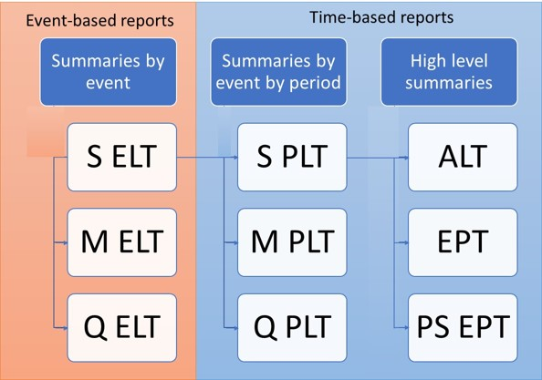

# Open Results Data worked examples

The worked examples in this section demonstrate how the variants of loss reports are calculated for platforms which use a sampling approach in their financial engine.
        
The worked examples are;

* SELT_SPLT - illustrates how Sample PLT is derived from Sample ELT
* SELT_MELT_QELT - illustrates how Moment ELT and Quantile ELT are derived from Sample ELT
* SPLT_MPLT_QPLT - illustrates how Moment PLT and Quantile PLT are derived from Sample PLT
* PSEPT - illustrates how Per Sample EPT is derived from Sample PLT for OEP (EPType = 1) and AEP (EPType = 3) Loss
* EPT_1_Mean_Damage - illustrates how EPT Mean Damage (EPCalc = 1) is derived from Sample PLT, for OEP (EPType = 1) and AEP (EPType = 3) Loss
* EPT_2_Full_Uncertainty - illustrates how EPT Full Uncertainty (EPCalc = 2) is derived from Sample PLT, for OEP (EPType = 1) and AEP (EPType = 3) Loss
* EPT_3_Per_Sample_Mean - illustrates how EPT Per Sample Mean (EPCalc = 3) is derived from PSEPT, for OEP (EPType = 1) and AEP (EPType = 3) Loss
* EPT_4_Sample_Mean - illustrates how EPT Sample Mean (EPCalc = 4) is derived from Sample PLT, for OEP (EPType = 1) and AEP (EPType = 3) Loss
* TVAR - applicable to all variants of return period losses in the EPT and PSEPT, illustrates how OEP TVAR (EPType = 2) and AEP TVAR (EPType = 4) is derived from return period losses.
                                                                                                           
### Reports overview

The main report types can be summarized as follows;
* **Event Loss Table** “ELT” with variants;
	* Sample ELT “SELT”
	* Moment ELT “MELT”
	* Quantile ELT “QELT”
* **Period (Year) Loss Table** “PLT” with variants;
	* Sample PLT “SPLT”
	* Moment PLT “MPLT”
	* Quantile PLT “QPLT”
* **Average Loss Table** “ALT” – containing Average Annual losses (AAL’s)
* **Exceedance Probability Table** “EPT” with variant;
	* Per Sample Exceedance Probability Table "PSEPT"

ALT and EPT reports are derived from ELTs and PLTs and represent higher statistical summaries of the more detailed ELTs and PLTs.

The loss report formats have been designed to be agnostic to the loss modelling platform that produced them. They have been based on OasisLMFs wide range of sample-based reports, with an extended set of fields to accomodate statistics that do not come from a sampling approach. Platforms that do not use sampling will not be able to populate the full range of reports, but the reports that are produced can be expressed in the same format as those that have been produced from a sampling methodology.

### Worked examples overview

The worked examples in this section demonstrate the derivation of ORD loss reports for the Oasis platform, which uses a Monte Carlo sampling approach to loss generation for a fixed set of event occurrences. 

The calculations use pivot tables on one or more input tables to manipulate the data into the right dimensions (group by fields, and typically sum or max of value operations) and then some simple excel formulas in the worksheet cells to compute the statistics themselves. The table relationships can be viewed in the worksheet data model for Excel 2010 or later (pre-2016 requires an add-in to be installed).

The diagram illustrates how the reports are derived from each other. Further reference data is needed for some calculations which is also provided in each worked example spreadsheet.

### How reports are derived

