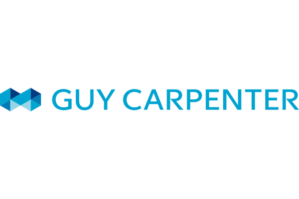
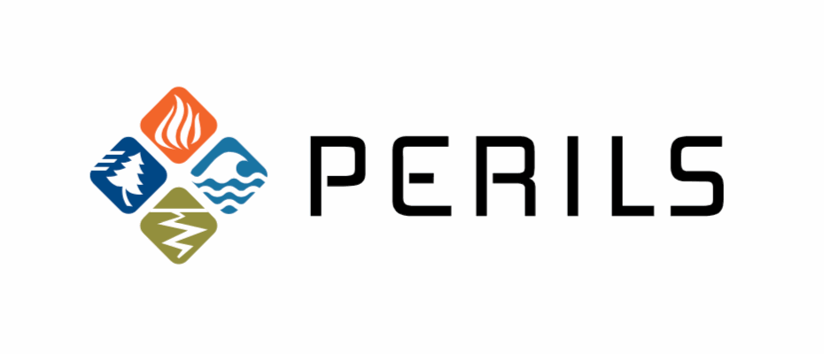

Steering Committee Members:

  &nbsp; 
&nbsp; &nbsp; &nbsp; 
 &nbsp; &nbsp; &nbsp; &nbsp; &nbsp; 
 &nbsp; &nbsp; &nbsp; &nbsp; &nbsp; 
 &nbsp; 
 &nbsp; &nbsp; &nbsp; &nbsp; 
 &nbsp; &nbsp; &nbsp; &nbsp; 
 &nbsp; &nbsp; &nbsp; &nbsp; 
 
 
 &nbsp; 
 &nbsp; &nbsp; &nbsp; &nbsp;
 &nbsp; &nbsp; &nbsp;
 &nbsp; &nbsp; 

&nbsp; 

# Open Data Standards (ODS)
ODS is curated by Oasis LMF and governed by the Open Data Standards Steering Committee (SC) which consists of attendees from (re)insurers, brokers and cat model vendors. 
The two main aspects of ODS are the Open Exposure Data and the Open Results Data. 

## Open Exposure Data (OED)
    
The aim of OED is to provide the industry with a robust, open and transparent data format. 
This will improve efficiency and transparency for the cat modelling community, facilitating data transfer and analytics across models and vendors.
OED is a model agnostic data format that comprises of four input files (Acc, Loc, RI Scope, RI Info). 

Detailed descriptions of each data field are covered in the **'Open Exposure Data Spec.xlsx'**.  The **'Open Exposure Data'** (.pdf) is a detailed document outlining the multiple sections of the OED and inludes multiple examples of how to code financial structures in the input files. Both documents are located:

https://github.com/OasisLMF/OpenDataStandards/tree/feature/doc_upgrade/OpenExposureData/Docs

A SQL Server schema and supporting scripts are available at the location below:

https://github.com/OasisLMF/OpenDataStandards/tree/feature/doc_upgrade/OpenExposureData/SQL%20Scripts

OED is directly supported by the Oasis Loss Modelling Framework.

## Open Results Data (ORD)

ORD was initially developed during the Lloyd's Lab innovation project (cohort 3) in November 2019 by a working group focussed on constructing model agnostic results formats and approriate data formats. 
These model outputs will cover an extensive suite of results that can be isolated by aspects of the exposure data, financial and statistical perspectives. Working documents can be found in the schema and docs folder.

ORD will be implemented by the Oasis Loss Modelling Framework during 2020 and all updates and progress will be located in this repo. 

## Governance

ODS is governed by a steering committee that meets every quarter and is chaired by Oasis LMF. The committee is made up of representatives from the following companies:

**Technology:** Nasdaq

**Cat Model Vendors:** Corelogic, AIR Worldwide, JBA Risk Management, Impact Forecasting

**Insurers:** Zurich, Ascot

**Reinsurers:** Renaissance Re, Swiss Re 

**Brokers:** Willis Towers Watson, Aon, BMS, Guy Carpenter

**Market & Data:** Lloyd's of London, Perils AG

&nbsp;
 
The main functions of this steering committee are to own the design of the data standards, make decisions about the technical implementation and prioritise work. Working groups may be formed from time to time to manage the design of a new major feature.

The ***maintenance group*** will maintain and update the assets that define the data standards. In the first instance, Oasis LMF will provide the maintainers, though this could be extended to include members of the user community.

### *Releases*

All the assets that define ODS will be managed in this GitHub repository. Minor releases will occur on a quarterly basis and will be backward compatible, and major releases will occur on an annual basis and require a change management process. The releases will follow the SemVer convention ( https://semver.org/), so given a version number MAJOR.MINOR.PATCH, increment the:

   * **MAJOR** version when you make incompatible changes e.g. changing column names, changing the structure of the data.
    
   * **MINOR** version when you add functionality in a backwards compatible manner e.g. adding a new column with a default     value, adding a new allowed value for an existing field.
    
   * **PATCH** version when you make backwards compatible bug fixes e.g. correcting a typo in a column label.
   
   
All new work will be done in **feature** branches, following the GitFlow model (https://nvie.com/posts/a-successful-git-branching-model/). The latest released version will be held in the **master** branch and the current development work will be in develop or specific feature branches.

### *Tracking*

All new work will be captured as issues in this repository. Any GitHub user can raise an issue and the maintenance group will classify as:

**Major Features:** These are major work items that will require significant work and may cause breaking changes. An example of a major feature would be extension to a new class of business.  All major features will be reviewed during a steering committee meeting.

**Minor Features:** These are minor work items that will not cause breaking changes. An example of a minor feature would be the inclusion of a new location attribute with a default value.  Minor features must be approved, by email, by two members of the steering committee before being addressed by the maintenance team. If approval is not given, or an objection is raised by a member of the steering committee, then the feature will be reviewed at the next a steering committee meeting.

### *Documentation Updates:* 

These can be actioned directly by the maintenance group.

### *Bugs:* 

These can be actioned directly by the maintenance group, assuming they do not cause a breaking change.

## Attributions
OED was developed by a working group of industry practitioners in close collaboration with AIR Worldwide who generously made their CEDE schema available to the industry. 
The working group was chaired by Matthew Jones with technical work led by Aiste Kalinauskaite both of NASDAQ (formerly Simplitium). 
The initial OED assets were ported from https://github.com/simplitium/oed on 28 April 2020 with permission from NASDAQ.

## License
The content of the Open Exposure Data (OED) format itself is licensed under the CC0 1.0 Universal license.
The MSSQL scripts to generate the relational database structure are licensed under BSD 3-clause license.
