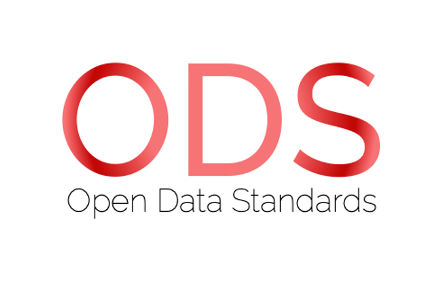
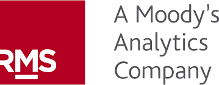

***Latest version of ODS***   
 

&nbsp; &nbsp; &nbsp; &nbsp; &nbsp; &nbsp; &nbsp; &nbsp; &nbsp; &nbsp; &nbsp; &nbsp; &nbsp; &nbsp; &nbsp; &nbsp; &nbsp; &nbsp; &nbsp; &nbsp; &nbsp; &nbsp; &nbsp; 
&nbsp; &nbsp; &nbsp; &nbsp; &nbsp; 
  

## Mission Statement: 
***ODS should be the standard used for exposure data, result outputs and contract(s) terminology for the (Re)Insurance industry and other interested parties in catastrophe modelling and exposure management across all classes of business.***

Steering Committee Members:

<table id="verticalalign">
    <tbody>
        <tr>
            <td align="middle" valign="middle"></td>
            <td align="middle" valign="middle"></td>
            <td align="middle" valign="middle"></td>
            <td align="middle" valign="middle"></td>
            <td align="middle" valign="middle"></td>
            <td align="middle" valign="middle"></td>
        </tr>
        <tr></tr>  <!--  empty line to avoid table zebra striping  -->
        <tr>
            <td align="middle" valign="middle"></td>
            <td align="middle" valign="middle"></td>
            <td align="middle" valign="middle"></td>
            <td align="middle" valign="middle"></td>
            <td align="middle" valign="middle"></td>
            <td align="middle" valign="middle"></td>
        </tr>
        <tr></tr>  <!--  empty line to avoid table zebra striping  -->
        <tr>
            <td align="middle" valign="middle"></td>
            <td align="middle" valign="middle"></td>
            <td align="middle" valign="middle"></td>
            <td align="middle" valign="middle"></td>
            <td align="middle" valign="middle"></td>
            <td align="middle" valign="middle"></td>
        </tr>
    </tbody>
</table>

&nbsp; 

                                                                                                                     
# Open Data Standards (ODS)

ODS is curated by Oasis LMF and governed by the Open Data Standards Steering Committee (SC), comprised of industry experts representing (re)insurers, brokers, service providers and catastrophe model vendors. The SC will evolve over time and include Subject Matter Experts to assist with areas requiring specific domain experience, including data validation and support for enhancing and automating the interoperability of these standards. 

The components of ODS are (but not limited to) the **Open Exposure Data (OED)** format and the **Open Results Data (ORD)** format. Both OED and ORD are designed to assist with solving interoperability problems current in the cat modelling community, where implementing a model-developer-independent exposure data and results format will assist in creating choice in the use of catastrophe models and analytical tools.

Further information and community views of ODS can be found on the ODS website:
https://oasislmf.org/open-data-standards

***It's important to know that ODS is NOT an Oasis standard, but an initiative developed by the market for the market.***

&nbsp; 

## Structure of ODS

The diagram below highlights the proposed, long-term structure of ODS and all the key components. Interoperability is vital to ensure efficient interaction across multiple databases, systems and external exposure management and data storage facilities.

 &nbsp;

&nbsp; 

**ODS Implementation into Oasis:** Oasis LMF are continuously expanding the ODS functionality they support on their platform, especially in their financial module (FM). 

Detailed documentation on which financial fields are supported in the Oasis kernel can be found here: https://github.com/OasisLMF/OasisLMF/blob/master/docs/OED_financial_terms_supported.xlsx
&nbsp; 

## Open Exposure Data (OED)

The aim of OED is to provide the industry with a robust, open, and transparent data format. This will improve efficiency and transparency for the cat modelling community, facilitating data transfer and analytics across models and vendors. OED is a model agnostic data format and the detailed descriptions of each data field for property are covered in the 'Open Exposure Data Spec.xlsx' and reference and background OED information can be found in the 'docs’ folder (https://github.com/OasisLMF/OpenDataStandards/tree/master/OpenExposureData/Docs). Examples of how to code multiple financial structures in the input files are also covered within these documents.

An additional OED location file 'LocPopulation' is also available here (https://github.com/OasisLMF/OpenDataStandards/blob/master/OpenExposureData/Example_inputs/pi_wind/OED_LocPopulation_v2.0.0.xlsx) for capturing demographic and socio-vulnerability data for more public sector/humanitarian use cases.

&nbsp;

## Open Data Transformation Framework (ODTF)

The ODTF is funded by the **The Insurance Development Forum (IDF)** and is an industry collaboration to develop a conversion tool that transforms exposure data to and from different formats including OED. More information can be found here:

https://github.com/OasisLMF/OpenDataTransform

&nbsp; 

**Liability** 

The focus for OED has primarily been on property cat business since its inception but has now expanded to support other lines of business. The liability data schema was released in April 2022 - details and docs can be found here:

https://github.com/OasisLMF/OpenDataStandards/tree/master/OpenExposureData/Liability

A cyber data standard is expected to be available in Q3/Q4 of 2022.

The web (HTML) version of the OED documentation can be viewed here https://oasislmf.github.io/OpenDataStandards/index.html

&nbsp; 

## Open Results Data (ORD)

ORD was initially developed during the Lloyd's Lab innovation project (Cohort 3) in 2019, by a working group led by Oasis, that focussed on constructing model agnostic results formats and appropriate data formats. These model outputs cover an extensive suite of results that can be isolated by aspects of the exposure data, financial and statistical perspectives. The ORD Standard encompasses:

More details and documents can be found here (https://github.com/OasisLMF/OpenDataStandards/tree/master/OpenResultsData)

&nbsp; 

## Governance

ODS is governed by a steering committee that meets periodically and is chaired by Oasis LMF. 

The governance and process around releases and updates of ODS can be found here but a schematic of the overview is shown below:
https://github.com/OasisLMF/OpenDataStandards/tree/master/Docs

 &nbsp;
 
A **Technical Working Group (TWG)** will maintain and update the assets that define the data standards. Although the TWG has a few core members from Oasis LMF and Nasdaq, its dynamic and will involve the users from the community who have proposed the updates or changes.

&nbsp; 

### *Releases*

All the assets that define ODS will be managed in this GitHub repository. All releases will follow the SemVer convention (https://semver.org/), so given a version number MAJOR.MINOR.PATCH, increment the:

   * **MAJOR** version when you make incompatible changes e.g. changing column names, changing the structure of the data.
    
   * **MINOR** version when you add functionality in a backwards compatible manner e.g. adding a new column with a default value, adding a new allowed value for an existing field.
    
   * **PATCH** version when you make backwards compatible bug fixes e.g. correcting a typo in a column label.
   
   
All new work will be done in **feature** branches, following the [GitFlow model](https://nvie.com/posts/a-successful-git-branching-model/). The latest released version will be held in the **master** branch and the current development work will be in develop or specific feature branches.

&nbsp; 

### *Tracking*

All new work will be captured as issues in this repository and contain all correspondence and associated documents or data. Any GitHub user can raise an issue and the TWG will classify as:

**Major Updates:** These are major work items that may require significant effort and may cause breaking changes. An example of a major feature would be  changes to the data schema with new or revised fields.  All major features will be reviewed during a steering committee meeting.

**Minor Updates:** These are minor work items that will not cause breaking changes. An example of a minor feature would be the inclusion of a new location attribute with a default value.  Minor features must be approved, by email, by two members of the steering committee before being addressed by the maintenance team. If approval is not given, or an objection is raised by a member of the steering committee, then the feature will be reviewed at the next steering committee meeting.

&nbsp; 

### *CSV to Parquet Data Conversion* 
Apache Parquet is an open-source columnar data format which has superior data compression and encoding schemes enabling more efficiency around the handling of large datasets. More info here (https://parquet.apache.org)

All source code and info on converting csv to Parquet data format can be found here (https://github.com/OasisLMF/OpenDataStandards/tree/master/src)

&nbsp; 

### *Documentation Updates* 

These can be actioned directly by the TWG but are likely to be done by Oasis LMF.

&nbsp; 

### *Bugs* 

These can be actioned directly by the TWG, assuming they do not cause a breaking change. All communication around bugs should be submitted in an issue within this repo.

&nbsp; 

## Attributions
OED was developed by a working group of industry practitioners in close collaboration with AIR Worldwide who generously made their CEDE schema available to the industry. 
The working group was chaired by Matthew Jones with technical work led by Aiste Kalinauskaite both of NASDAQ (formerly Simplitium). 
The initial OED assets were ported from https://github.com/simplitium/oed on 28 April 2020 with permission from NASDAQ.

&nbsp; 

## License
The content of ODS including the documentation and the schema within both Open Exposure Data (OED) and Open Results Data (ORD) are licensed under the CC0 1.0 Universal license.
Any code, MS SQL scripts or the development of tools are licensed under BSD 3-clause license.
